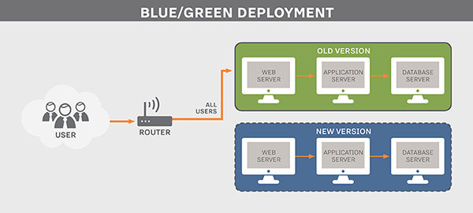

# Continuous delivery (Entrega contínua)
Com o processo de desenvolvimento mais ágil, é possível entregar melhorias ao usuário final, e responder a demandas de mercado muito mais rápido.

O cenário ideal seria apertar um botão e entregar uma atualização do seu código para algum ambiente, seja de homologação, teste ou produção.

A entrega contínua deve começar pela implantação (deploy) do software em um ambiente de teste que espelhe o de produção.

O desenvolvedor após desenvolver uma nova funcionalidade ou produto deverá subir esse novo código para o ambiente de testes. Deverá então ser executados os testes de aceitação automatizados, ou testes de regressão, para garantir que nenhuma nova mudança de código quebrou as funcionalidades existentes. Casos os estes teste falhem o processo deve parar. O desenvolvedor deve ser notificado automaticamente. Caso os testes de aceitação passem, todos os testes não-funcionais automatizados devem ser executados.

Testes de Carga e de segurança pode sem executados nessa etapa também.

Caso a bateria de testes não detecte nenhum problema, o novo código estará pronto para ser incorporado ao ambiente de produção.

## Métodos de implantação (deploy)

### Implantação azul/verde (blue/green deployment)

`blue/green deployment` é uma estratégia em implantação de software que conta com duas configurações idênticas de ambiente em produção, que ficam alternando entre ativa e inativa. Um ambiente é chamado de blue, e o outro ambiente que é idêntico é chamado de green.

As cores Azul e Verde são apenas marcadores de posição para representar um grupo de servidores.

Os dois ambientes, azul e verde, podem lidar com toda a carga de produção, e são usados de forma alternada e não como um espaço primário e secundário. Enquanto um ambiente fica ativo, o outro fica ocioso. Quando uma nova versão de software está pronta, a equipe implementa essa nova versão no ambiente ocioso, onde é testada. Uma vez que a nova versão tenha sido examinada, a equipe irá ativar o ambiente ocioso, geralmente ajustando uma configuração de roteador para redirecionar o tráfego. Deixando o ambiente que estava ativo, dessa vez ocioso.

Portanto, a estratégia `azul/verde` ajuda a subir uma nova atualização, minimizando o tempo de inatividade.

### Servidor Canário

Um Servidor Canário funciona como um canário das minas de carvão, é um servidor onde colocamos uma certa porcentagem do tráfego apenas para verificar seu comportamento, e verificar se o novo release sobrevive.

Ferramentas para ajudar neste processo:
- [Ansible](https://www.ansible.com/)
- [Chef](https://www.chef.io/)
- [Puppet](https://puppet.com/)
